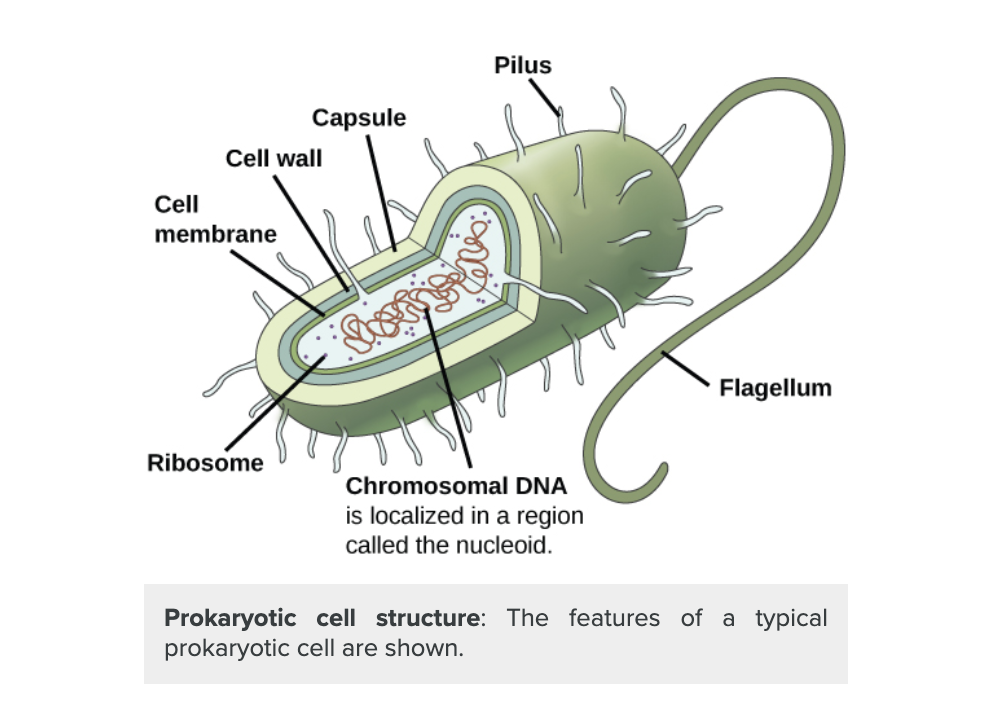

# Synthetic Biology Artificially Deep

## References

(2020) [Decoding DNA Data Storage for Investment](https://www.ncbi.nlm.nih.gov/pmc/articles/PMC7521213/)

(2020) [DNA Punch Cards for Storing Data on Native DNA Sequences via Enzymatic Nicking](https://www.nature.com/articles/s41467-020-15588-z)

(2020) [Dynamic and Scalable DNA Based Information Storage](https://www.nature.com/articles/s41467-020-16797-2)

(2019) [Opportunities at the Intersection of Synthetic Biology, Machine Learning and Automation](https://pubs.acs.org/doi/pdf/10.1021/acssynbio.8b00540)

(2019) [Driving the Scalability of DNA_Based Information Storage Systems](https://www.biorxiv.org/content/biorxiv/early/2019/03/29/591594.full.pdf)

(2019) [Demonstration of End to End Automation of DNA Data Storage](https://www.nature.com/articles/s41598-019-41228-8/)

(2018) [CRSeek: a Python module for facilitating complicated CRISPR design strategies](https://peerj.com/preprints/27094.pdf)

(2017) [Addressable Configurations of DNA Nanostructures for Rewritable Memory](https://academic.oup.com/nar/article/45/19/11459/4097620)

(2015) [A Rewritable, Random-Access DNA-Based Storage System](https://www.nature.com/articles/srep14138)

(2014) [A Brief History of Synthetic Biologoy](https://collinslab.mit.edu/files/nrm_cameron.pdf)

### Notes 

[CRSeek: a Python module for facilitating complicated CRISPR design strategies](https://peerj.com/preprints/27094.pdf)

CRISPR are a family of related genes that function as a defense system in prokaryotes against phages and plasmid DNA.

#### Definitions

**Prokaryotes** are unicellular organisms that lack organelles or other internal membrane-bound structures. Therefore, they do not have a nucleus, but, instead, generally have a single chromosome: a piece of circular, double-stranded DNA located in an area of the cell called the nucleoid. Most prokaryotes have a cell wall outside the plasma membrane. [source](https://courses.lumenlearning.com/boundless-biology/chapter/structure-ofprokaryotes/#:~:text=Prokaryotes%20are%20unicellular%20organisms%20that,the%20cell%20called%20the%20nucleoid.)

